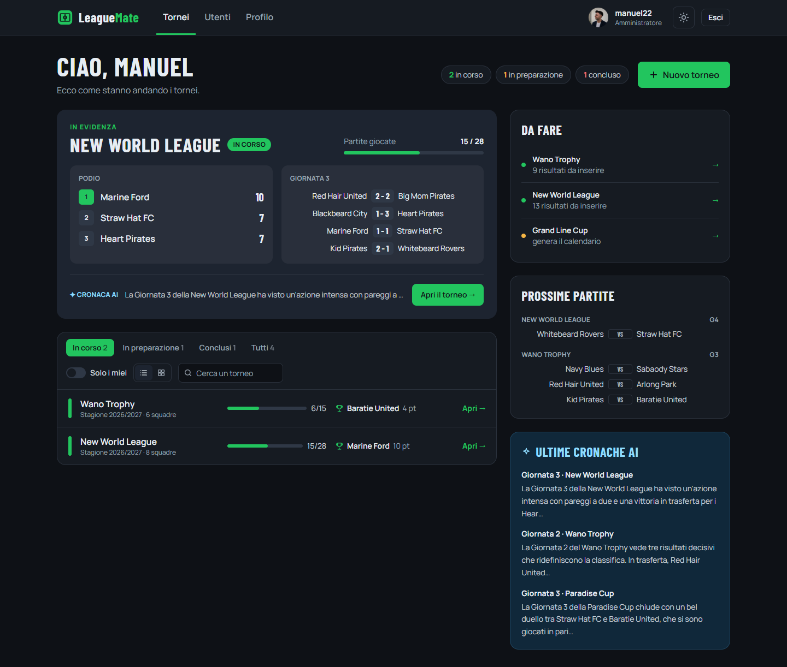
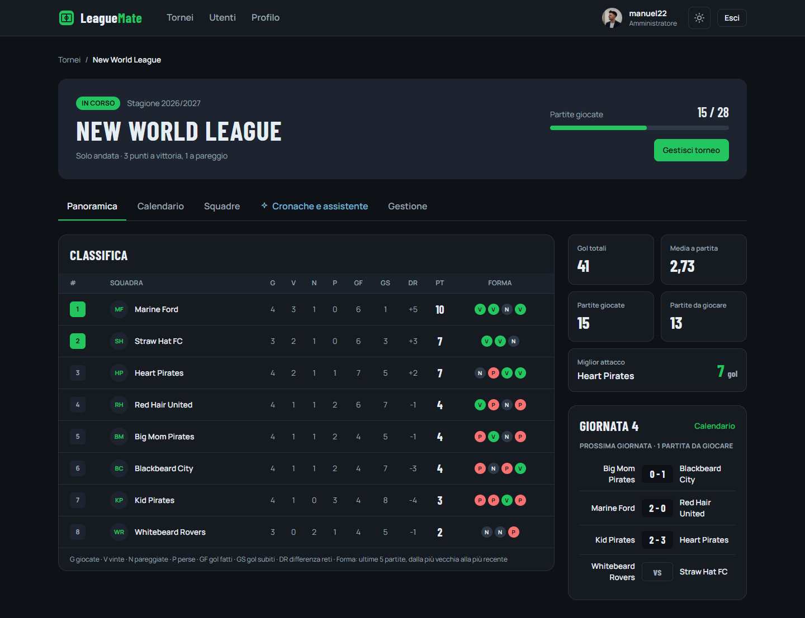
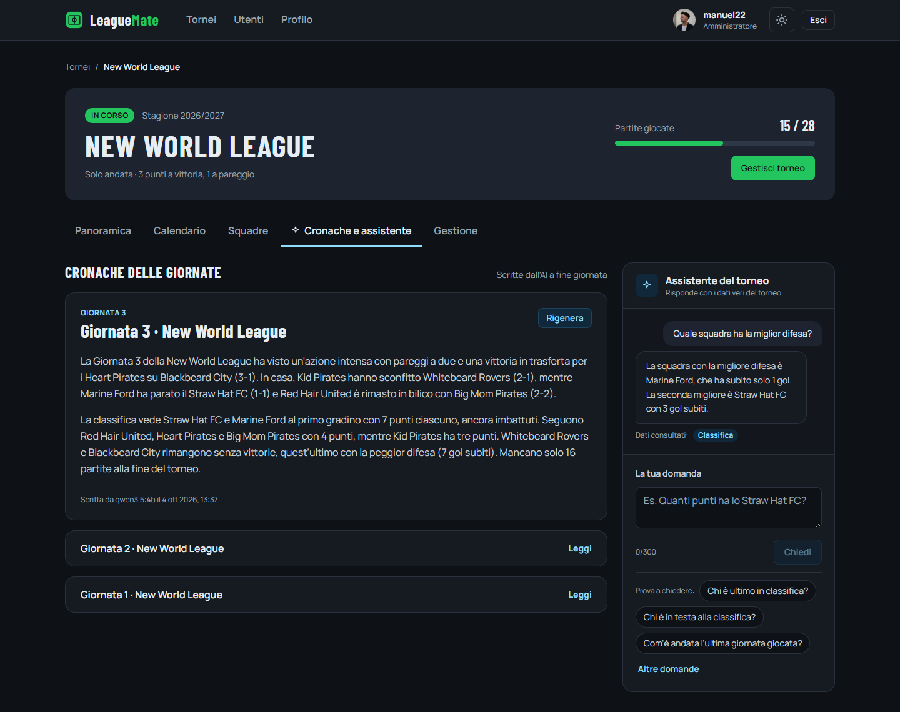
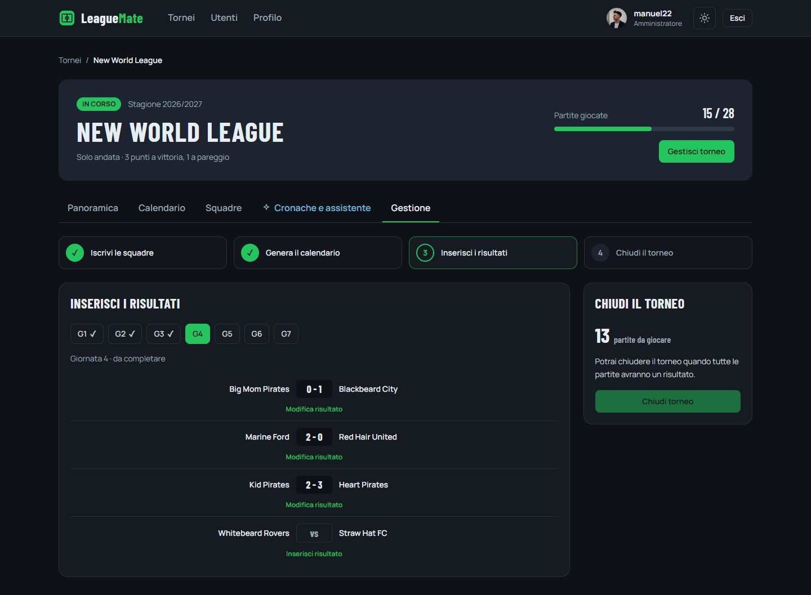
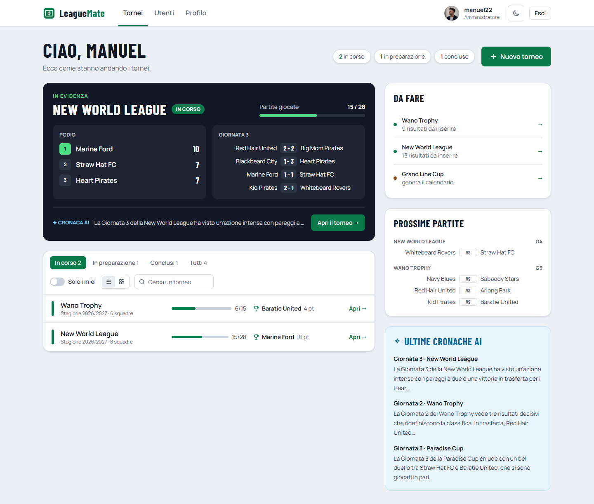

# LeagueMate

**Gestione di tornei amatoriali di calcio, con cronache e assistente scritti da un'intelligenza artificiale locale.**

LeagueMate permette di organizzare un torneo a girone all'italiana dall'iscrizione delle squadre fino alla chiusura: calendario generato automaticamente, risultati, classifica e statistiche sempre aggiornate. A fine giornata un modello AI che gira sul proprio computer scrive la **cronaca** delle partite, e un **assistente** risponde alle domande sul torneo usando i dati veri.



---

## Indice

- [Funzionalità](#funzionalità)
- [Tecnologie](#tecnologie)
- [Avvio rapido con Docker](#avvio-rapido-con-docker)
- [Utenti e dati demo](#utenti-e-dati-demo)
- [Provare l'AI in 2 minuti](#provare-lai-in-2-minuti)
- [Configurazione](#configurazione)
- [Funzionalità AI](#funzionalità-ai)
- [Sviluppo in locale](#sviluppo-in-locale)
- [Test e qualità](#test-e-qualità)
- [Struttura del repository](#struttura-del-repository)
- [Scelte progettuali](#scelte-progettuali)
- [Screenshot](#screenshot)
- [Sviluppi futuri](#sviluppi-futuri)
- [Riferimenti](#riferimenti)

---

## Funzionalità

**Per tutti gli utenti registrati**
- Home a bacheca: torneo in evidenza con podio e ultima giornata, prossime partite, ultime cronache AI, elenco dei tornei filtrabile per stato e ricercabile, vista a elenco o a griglia.
- Pagina del torneo con schede raggiungibili da indirizzo (`/tornei/2/calendario`): **Panoramica** (classifica con la forma delle ultime 5 partite, statistiche, prossima giornata), **Calendario**, **Squadre**, **Cronache e assistente**.
- **Cronache AI** di ogni giornata completata e **assistente del torneo** a cui fare domande in italiano.
- Profilo diviso in sezioni: profilo pubblico (bio, foto, telefono), dati dell'account (nome, cognome, email) e sicurezza (cambio password, uscita da tutti i dispositivi).
- Tema scuro e tema chiaro, interfaccia adatta a smartphone e a schermi grandi.

**Per gli organizzatori** (ruolo ORGANIZER, solo sui propri tornei)
- Creazione di un torneo, anche con andata e ritorno.
- Scheda **Gestione** che segue il ciclo di vita del torneo in 4 passi: iscrizione delle squadre → generazione del calendario → inserimento dei risultati → chiusura.
- Elenco "Da fare" nella home con le azioni in sospeso e rigenerazione delle cronache.

**Per gli amministratori** (ruolo ADMIN)
- Tutto ciò che può fare un organizzatore, su ogni torneo.
- Pagina **Utenti**: chi si registra parte come Utente, l'admin lo può promuovere a Organizzatore o Amministratore. Il ruolo non si sceglie in registrazione, così nessuno può autoassegnarsi permessi.

---

## Tecnologie

| Parte | Tecnologie |
|---|---|
| Frontend | React 19, TypeScript 6, Vite 8, Tailwind CSS 4, React Router 8, TanStack Query 5, axios, react-hook-form, oxlint |
| Backend | Java 21, Spring Boot 4.1, Spring Security con Spring Authorization Server (token opachi), Spring Data JPA / Hibernate, Flyway, Bucket4j, springdoc-openapi |
| Database | MySQL 8 (H2 in memoria e Testcontainers nei test) |
| AI | Ollama con il modello `qwen3.5:4b`, oppure un servizio compatibile OpenAI (es. OpenRouter) |
| Infrastruttura | Docker Compose, nginx (serve il frontend e fa da proxy per le API), GitHub Actions |

---

## Avvio rapido con Docker

### Requisiti
- [Docker Desktop](https://www.docker.com/products/docker-desktop/) (oppure Docker Engine con il plugin Compose).
- Circa **8 GB di RAM** liberi e **5 GB di spazio** su disco (il modello AI occupa circa 3,4 GB).
- Consigliata una **scheda video NVIDIA**: senza, l'app funziona ma le funzioni AI possono essere molto lente.

### Avvio

```bash
git clone https://github.com/Barbagallo2296/LeagueMate.git
cd LeagueMate
docker compose up --build
```

> Su Windows, se `git clone` si ferma con l'errore *"Filename too long"*, clonare in una cartella con un percorso corto (per esempio sul Desktop) oppure abilitare i percorsi lunghi e ripetere il clone:
>
> ```bash
> git config --global core.longpaths true
> ```

**Con una scheda video NVIDIA** conviene avviare invece così: l'AI passa da minuti a pochi secondi per risposta (vedi [Funzionalità AI](#funzionalità-ai)).

```bash
docker compose -f docker-compose.yml -f docker-compose.gpu.yml up --build
```

Poi apri **http://localhost:3000** ed entra con uno degli [utenti demo](#utenti-e-dati-demo). Le API e la loro documentazione interattiva (Swagger) sono su http://localhost:8080/swagger-ui.html.

Cosa succede al primo avvio:
1. vengono costruite le immagini del backend (Maven) e del frontend (Node → nginx): qualche minuto;
2. MySQL parte e Flyway crea le tabelle e carica i **dati demo**;
3. il servizio `ollama-init` scarica il modello AI (circa 3,4 GB, una sola volta) e lo carica in memoria.

L'app è utilizzabile **subito**, anche mentre il modello si sta scaricando: in quel momento le funzioni AI non sono ancora disponibili e si attivano da sole appena il modello è pronto. Dal secondo avvio in poi bastano pochi secondi.

Per fermare tutto: `docker compose down`. Per ripartire dai dati demo originali: `docker compose down` e poi `docker volume rm leaguemate_mysql_data` (il modello AI resta scaricato).

---

## Utenti e dati demo

| Username | Password | Ruolo | Cosa mostra |
|---|---|---|---|
| `manuel22` | `password123` | Amministratore | Pagina Utenti per cambiare i ruoli, gestione di ogni torneo |
| `law_organizer` | `password123` | Organizzatore | Gestione di Grand Line Cup e New World League, co-organizzatore del Wano Trophy |
| `smoker_organizer` | `password123` | Organizzatore | Gestione di Paradise Cup e Wano Trophy |
| `shanks_player` | `password123` | Utente | Vista di un utente semplice: consultazione, cronache e assistente |
| `zoro_player`, `nami_player`, `sanji_player`, `robin_player` | `password123` | Utente | Giocatori nella rosa dello Straw Hat FC |
| `boop` | `password123` | Amministratore | Secondo amministratore, con una foto profilo presa da un link esterno |

**Avatar.** Nel profilo si può scegliere uno degli 8 avatar predefiniti a tema calcio (file SVG in `frontend/public/avatars/`, serviti dal frontend stesso, quindi funzionano anche senza internet) oppure incollare l'indirizzo di un'immagine esterna. Chi non sceglie nulla, come un utente appena registrato, vede le iniziali del nome. Tra gli utenti demo, `manuel22`, `law_organizer`, `shanks_player` e `zoro_player` hanno già un avatar predefinito, `boop` usa un'immagine esterna (serve la connessione a internet per vederla) e gli altri mostrano le iniziali.

I tornei demo coprono tutti gli stati:

| Torneo | Stato | Situazione |
|---|---|---|
| **Grand Line Cup** | In preparazione | 4 squadre iscritte, pronto per generare il calendario |
| **New World League** | In corso | 8 squadre, giornate 1-3 giocate, nella giornata 4 manca una sola partita |
| **Wano Trophy** | In corso | 6 squadre, 2 giornate giocate su 5, due organizzatori |
| **Paradise Cup** | Concluso | 4 squadre, vinto dallo Straw Hat FC |

---

## Provare l'AI in 2 minuti

1. Entra come **`law_organizer`** e apri **New World League** → scheda **Gestione**.
2. Si apre da sola la giornata 4, che ha una sola partita da giocare: **Whitebeard Rovers - Straw Hat FC**. Premi "Inserisci risultato", scrivi un punteggio e salva.
3. La giornata è completa: il backend avvia in background la scrittura della cronaca. Apri la scheda **Cronache e assistente**: vedi "L'AI sta scrivendo la cronaca..." e, dopo qualche secondo, il testo compare da solo, senza ricaricare la pagina.
4. Nello stesso pannello fai una domanda all'**assistente**, per esempio *"Quale squadra ha la miglior difesa?"*. Sotto la risposta vedi quali dati ha consultato (es. "Classifica").

Le giornate già giocate non hanno ancora una cronaca: chi gestisce il torneo può crearla con il pulsante "Genera cronaca".

---

## Configurazione

Nessuna configurazione è obbligatoria: ogni variabile ha un valore predefinito. Per cambiarle si copia `.env.example` in `.env` e si modificano i valori (porte con `WEB_PORT`, `API_PORT`, `DB_PORT`; AI con le variabili `AI_*`). Il database è esposto sulla porta **3307**, così non si scontra con un MySQL già installato sul PC. L'elenco completo è nel [README del backend](backend/README.md#avvio-con-docker-consigliato).

---

## Funzionalità AI

- **Cronaca della giornata.** Quando l'ultima partita di una giornata riceve un risultato, il backend scrive in background due paragrafi di cronaca; il frontend la mostra appena è pronta, senza ricaricare la pagina.
- **Assistente del torneo.** Risponde in italiano alle domande sul torneo usando il *tool calling*: il modello chiede al backend classifica, statistiche, giornate o partite di una squadra e risponde solo con quei dati.

**Principio chiave:** è il backend a scrivere i fatti in italiano (per esempio "Marine Ford ha battuto Red Hair United 2-0 in casa") e il modello non deve mai interpretare numeri grezzi. Se l'AI non è disponibile l'applicazione funziona lo stesso.

**Un modello piccolo, scelto per la didattica.** Il progetto usa `qwen3.5:4b`, un modello leggero (circa 3,4 GB) e gratuito che parte su un normale PC anche senza GPU (ma in quel caso può essere molto lento, vedi sotto). È adatto a dimostrare il funzionamento, ma ha dei limiti: lo stile delle cronache varia e l'assistente a volte sbaglia i calcoli che fa da solo. In un'applicazione reale servirebbe un modello molto più grande e performante, su un server con GPU oppure tramite un servizio online. Il backend è già pronto per questo: basta cambiare le variabili nel `.env`, senza toccare il codice.

```env
AI_PROVIDER=openai
AI_BASE_URL=https://openrouter.ai/api/v1
AI_MODEL=nome-del-modello
AI_API_KEY=la-tua-chiave
```

Funziona con qualsiasi servizio compatibile con le API di OpenAI (OpenRouter, OpenAI, Groq...); per l'assistente serve un modello che supporti il *tool calling*. Prompt, parametri e tempi misurati sono nella sezione [Funzionalità AI del README del backend](backend/README.md#funzionalità-ai).

> **Attenzione: senza GPU l'AI può essere molto lenta.** Il modello locale parte su qualsiasi PC, ma non su tutte le configurazioni è utilizzabile: con la sola CPU i tempi dipendono molto dal processore e dalle risorse assegnate a Docker. Su un portatile con Intel Core Ultra 7 e sola CPU l'assistente ha impiegato **2-4 minuti** per risposta e la cronaca ha superato il tempo massimo di attesa del backend (180 s), finendo in `FAILED`. Sullo **stesso PC con la GPU NVIDIA** attiva le stesse operazioni hanno richiesto circa **2 secondi** (assistente) e **6 secondi** (cronaca).
>
> Per questo è consigliato usare una **GPU NVIDIA**:
>
> ```bash
> docker compose -f docker-compose.yml -f docker-compose.gpu.yml up --build
> ```
>
> oppure un servizio online come descritto sopra. Se si può usare solo la CPU, si può aumentare il tempo massimo di attesa delle cronache con `AI_READ_TIMEOUT=600s` nel `.env` (l'assistente invece ha comunque un limite di 200 secondi, oltre il quale il sito mostra un messaggio che lo spiega), oppure provare il modello più piccolo `AI_MODEL=qwen3.5:2b`. In ogni caso il resto dell'applicazione funziona normalmente anche quando l'AI è lenta o non disponibile.

---

## Sviluppo in locale

Il modo più semplice per lavorare sul frontend: database, AI e backend in Docker, frontend con Vite, che aggiorna la pagina appena si salva un file.

```bash
docker compose up -d db ollama ollama-init api
cd frontend
npm install
npm run dev
```

Con una GPU NVIDIA si aggiunge `-f docker-compose.yml -f docker-compose.gpu.yml` subito dopo `docker compose`. Il frontend è su http://localhost:5173 e Vite inoltra le chiamate `/api` al backend su `localhost:8080`. Dopo una modifica al backend basta ricostruirlo con `docker compose up -d --build api`.

Per avviare il backend fuori da Docker (Java 21, Maven) vedi la sezione [Avvio in locale del README del backend](backend/README.md#avvio-in-locale).

---

## Test e qualità

- **Backend:** 264 test (JUnit 5, Mockito, MockMvc, Spring Security Test), tutti verdi, con una **copertura del 95%** misurata con JaCoCo. Un test usa un **MySQL 8 reale** con Testcontainers e viene saltato se Docker non è disponibile. Nessun test richiede Ollama: l'AI è disattivata o simulata.

  ```bash
  cd backend
  ./mvnw verify
  ```

- **Frontend:** controllo dei tipi TypeScript e analisi del codice con oxlint.

  ```bash
  cd frontend
  npm run lint
  npm run build
  ```

- **Integrazione continua:** a ogni push su `main` GitHub Actions esegue due job in parallelo: `backend` (`mvnw verify` con JDK 21 e report JaCoCo) e `frontend` (`npm ci`, `lint` e `build`).

- **Postman:** in `docs/` c'è una collection con 54 richieste organizzate in 10 cartelle; login, rinnovo e logout dei token sono gestiti in automatico.

---

## Struttura del repository

```
LeagueMate/
├── backend/                  API Spring Boot (vedi backend/README.md)
│   ├── src/main/java/...     controller, service, repository, security, ai
│   ├── src/main/resources/   configurazione, migrazioni Flyway e dati demo
│   └── Dockerfile
├── frontend/                 Applicazione React
│   ├── src/api/              chiamate al backend (axios) e tipi
│   ├── src/auth/             sessione e utente collegato
│   ├── src/components/       componenti condivisi e libreria grafica (ui/)
│   ├── src/pages/            pagine: home, torneo, profilo, utenti...
│   ├── public/avatars/       avatar predefiniti (SVG)
│   ├── Dockerfile            build multi-stage Node → nginx
│   └── nginx.conf            sito + proxy /api verso il backend
├── docs/                     collection Postman e screenshot
├── docker-compose.yml        db, ollama, ollama-init, api, web
├── docker-compose.gpu.yml    aggiunta facoltativa per GPU NVIDIA
├── .env.example              variabili di configurazione
└── .github/workflows/ci.yml  integrazione continua
```

---

## Scelte progettuali

- **Sessione sicura.** Il backend emette token opachi (non JWT), salvati nel database solo come hash. Il frontend tiene l'access token (15 minuti) solo in memoria e il refresh token (7 giorni) nel `localStorage`. Se una richiesta riceve 401, un interceptor di axios fa **una sola** refresh alla volta, condivisa da tutte le richieste in attesa: i refresh token vengono ruotati, quindi due refresh in parallelo invaliderebbero la sessione.
- **Permessi controllati due volte.** Il frontend mostra solo le azioni consentite (ruolo, organizzatore del torneo, stato del torneo), ma il controllo vero è sempre nel backend con `@PreAuthorize` e regole a livello di risorsa.
- **Dati e cache.** TanStack Query gestisce caricamenti, errori e cache. Le chiavi sono organizzate per torneo (`['tournament', id, ...]`), quindi dopo un risultato una sola invalidazione aggiorna insieme calendario, classifica, statistiche e cronache.
- **Pagine con indirizzo.** Le schede del torneo e le sezioni del profilo sono rotte annidate di React Router: funzionano F5, il tasto indietro e i link condivisi.
- **Temi.** Tutti i colori sono variabili di Tailwind 4 definite in un solo punto: il tema chiaro è un blocco CSS che le ridefinisce. Sugli schermi molto grandi la dimensione di base del testo cresce, e con essa tutta l'interfaccia.
- **Docker.** Il frontend è costruito con un Dockerfile multi-stage e servito da nginx, che fa anche da reverse proxy per `/api`, con un timeout adatto alle risposte dell'AI e l'indirizzo reale del client passato al backend per il rate limit sul login.

---

## Screenshot

| | |
|---|---|
|  **Panoramica del torneo** con la forma delle squadre |  **Cronaca AI e assistente** |
|  **Gestione** in 4 passi per l'organizzatore |  **Tema chiaro** |

---

## Sviluppi futuri

- **Risposte dell'assistente in streaming** (Server-Sent Events), che compaiono parola per parola invece che tutte insieme.
- **Caricamento della foto del profilo** dal computer: oggi si sceglie un avatar predefinito o si incolla il link di un'immagine. Richiede un endpoint di upload con controllo di tipo e dimensione.
- **Data, ora e campo delle partite**, con un calendario vero e proprio e i promemoria.
- **Marcatori e statistiche dei giocatori**: classifica cannonieri e statistiche individuali.
- **Notifiche** quando viene inserito un risultato o è pronta una cronaca.
- **Altre formule di torneo**: eliminazione diretta e gironi con fase finale.

---

## Riferimenti

- [Spring Boot](https://docs.spring.io/spring-boot/) · [Spring Security](https://docs.spring.io/spring-security/reference/) · [Spring Authorization Server](https://docs.spring.io/spring-authorization-server/reference/)
- [Flyway](https://documentation.red-gate.com/flyway) · [Testcontainers](https://java.testcontainers.org/)
- [React](https://react.dev/) · [Vite](https://vite.dev/) · [Tailwind CSS](https://tailwindcss.com/docs) · [React Router](https://reactrouter.com/) · [TanStack Query](https://tanstack.com/query/latest) · [axios](https://axios-http.com/) · [React Hook Form](https://react-hook-form.com/)
- [Ollama](https://ollama.com/) · [Qwen](https://qwenlm.github.io/) · [OpenRouter](https://openrouter.ai/docs)
- [Docker Compose](https://docs.docker.com/compose/) · [nginx](https://nginx.org/en/docs/)

---

## Autore

**Manuel Barbagallo** 
